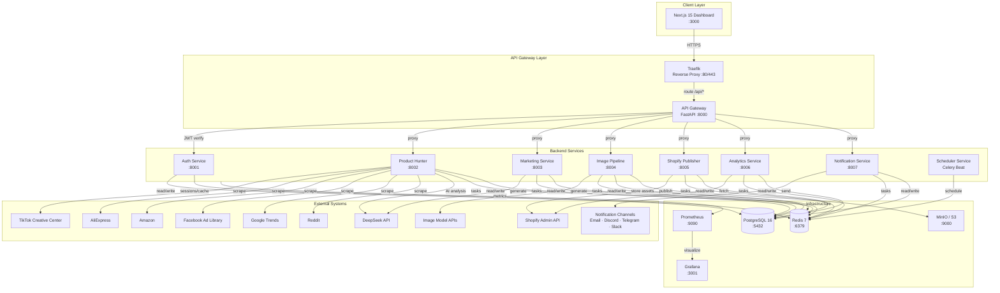
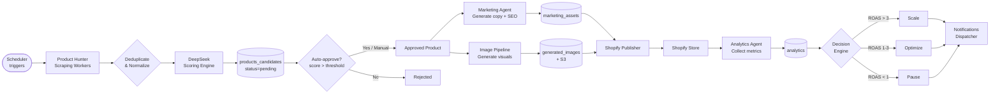
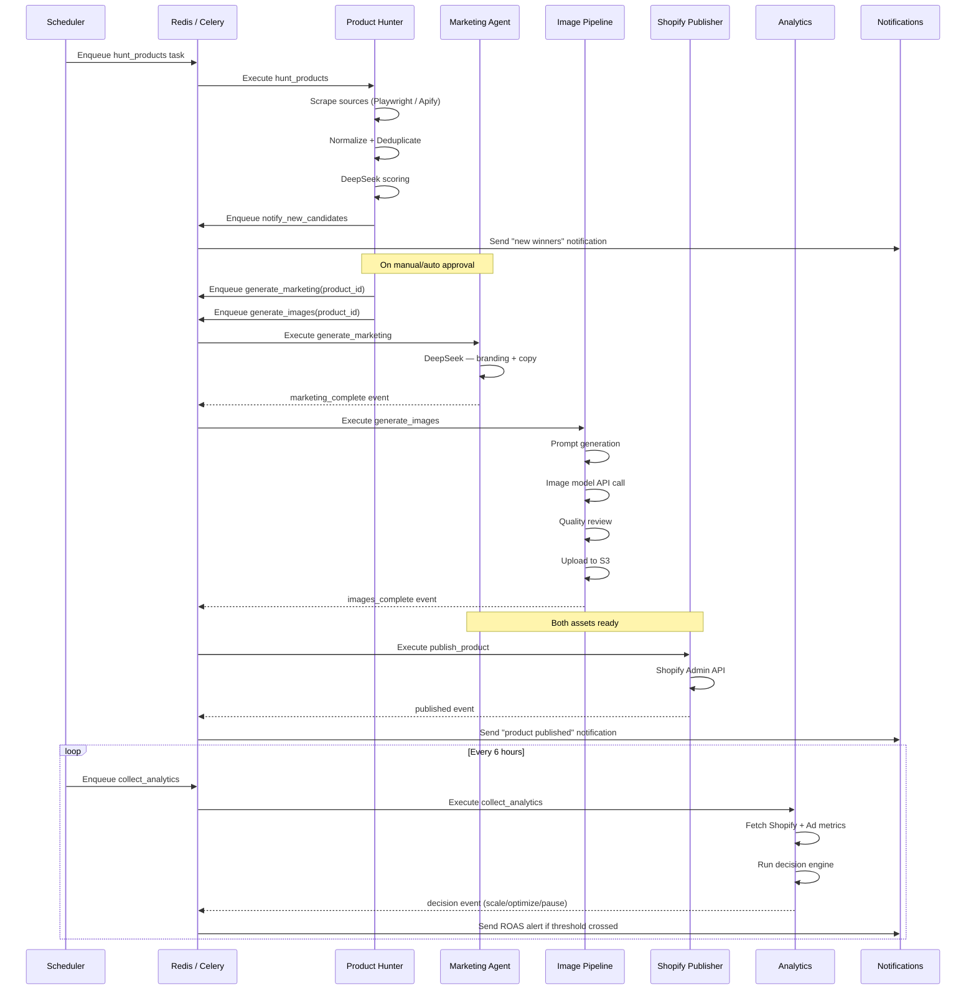
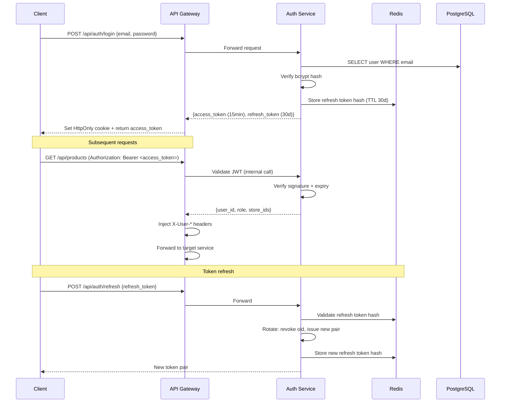
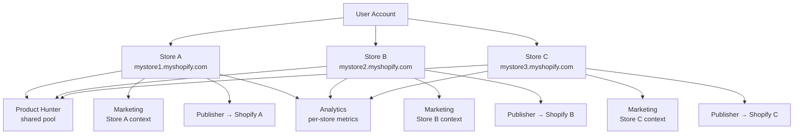
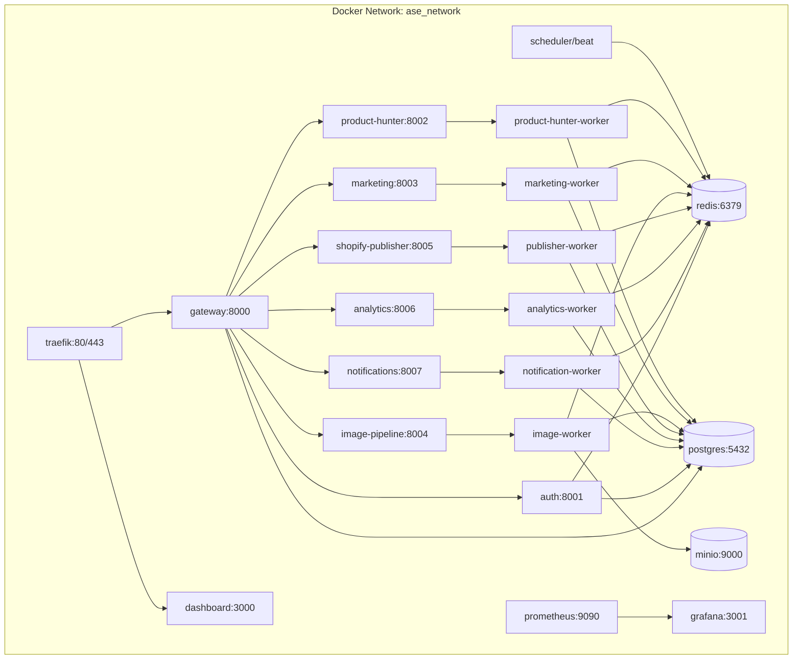
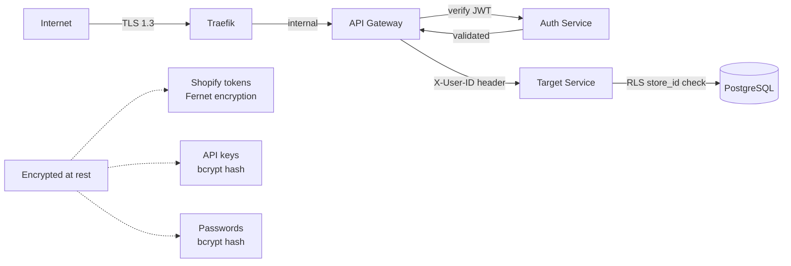

# Autonomous Shopify Engine (ASE) — Architecture

> **Phase 0 — Architecture & Technical Design**
> This document defines the complete system architecture. No implementation begins until this is validated.

---

## 1. System Overview

ASE is a multi-agent SaaS platform that autonomously discovers profitable products, generates marketing content, publishes to Shopify, and monitors performance — all from a single dashboard supporting multiple stores.

**Core design principles:**
- Each service owns its domain and can be deployed independently
- All inter-service async communication goes through Celery/Redis (not direct HTTP calls between services)
- All sync external-facing communication routes through the API Gateway
- Shared database schema in Phase 1, migrating to per-service schemas in Phase 3+
- Secrets never stored in code; always injected via environment or secret manager

---

## 2. System Topology

---

## 3. Product Lifecycle Data Flow

---

## 4. Agent Orchestration

---

## 5. Authentication Flow

---

## 6. Multi-Store Architecture

Every DB row is tagged with `store_id`. The API Gateway enforces store ownership: a user can only access `store_id` values that belong to their account.

---

## 7. Infrastructure Topology (Docker Compose)

---

## 8. Service Responsibilities & Ports

| Service | Port | Responsibility | Workers |
|---|---|---|---|
| Traefik | 80/443 | Reverse proxy, TLS termination | — |
| API Gateway | 8000 | Auth middleware, routing, rate limiting | — |
| Dashboard (Next.js) | 3000 | Web UI (BFF pattern) | — |
| Auth Service | 8001 | JWT, refresh tokens, users, API keys | — |
| Product Hunter | 8002 | Scraping, scoring, candidate mgmt | `product-hunter-worker` |
| Marketing | 8003 | Branding, copy, ad generation | `marketing-worker` |
| Image Pipeline | 8004 | Prompt gen, image gen, S3 upload | `image-worker` |
| Shopify Publisher | 8005 | Shopify Admin API operations | `publisher-worker` |
| Analytics | 8006 | Metrics collection, ROAS decisions | `analytics-worker` |
| Notifications | 8007 | Multi-channel dispatch | `notification-worker` |
| Scheduler | — | Celery Beat, cron orchestration | — |
| PostgreSQL | 5432 | Primary data store | — |
| Redis | 6379 | Cache, Celery broker/backend, sessions | — |
| MinIO | 9000 | S3-compatible asset storage | — |
| Prometheus | 9090 | Metrics scraping | — |
| Grafana | 3001 | Metrics visualization | — |

---

## 9. Inter-Service Communication Rules

| Pattern | When to use | Implementation |
|---|---|---|
| Sync HTTP | User-facing requests only | Via API Gateway → service |
| Async Task | Background operations | Celery task on named queue |
| Event notification | Cross-service side-effects | Celery task (fire-and-forget) |
| Cache read | Hot data, session data | Redis GET/SETEX |
| Direct DB query | Within service own domain only | SQLAlchemy session |

**Services never call each other directly.** All cross-service async work goes through named Celery queues.

---

## 10. Security Architecture

**Layers:**
1. **Transport**: TLS 1.3 via Traefik (Let's Encrypt in prod)
2. **Network**: All services on private Docker network; only Traefik exposed
3. **Auth**: JWT RS256 (asymmetric keys), 15-min access tokens
4. **Authorization**: Role-based (Admin / Operator / Viewer) + store ownership check
5. **Data**: Shopify access tokens encrypted with Fernet before DB storage
6. **Input**: Pydantic validation on all endpoints; parameterized SQL via SQLAlchemy
7. **Rate limiting**: Sliding window per IP and per user_id in Redis

---

## 11. Observability Architecture

Every service exposes:
- `GET /health` — liveness probe
- `GET /ready` — readiness probe
- `GET /metrics` — Prometheus scrape endpoint

Structured JSON logs flow: service → stdout → Loki (or CloudWatch in prod).

Agent runs are recorded in `agent_logs` with token usage and AI cost tracking.
