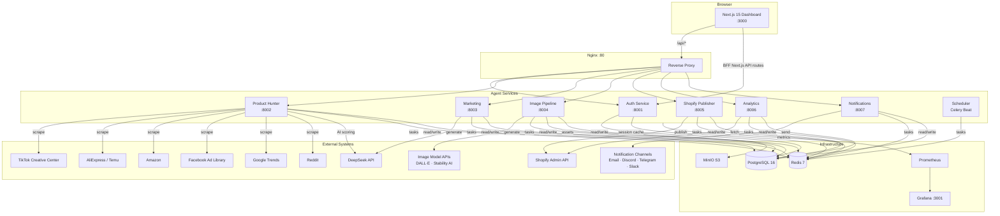
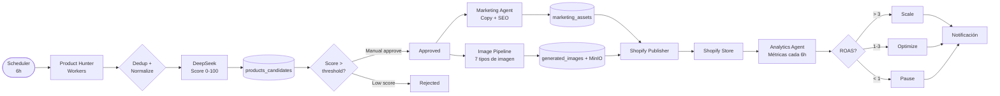
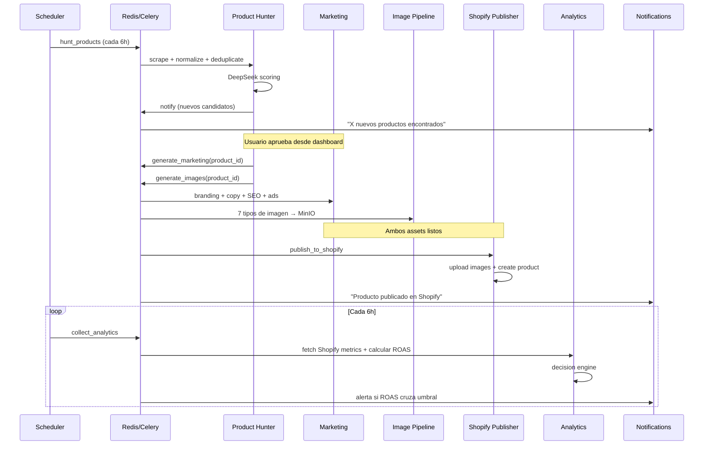
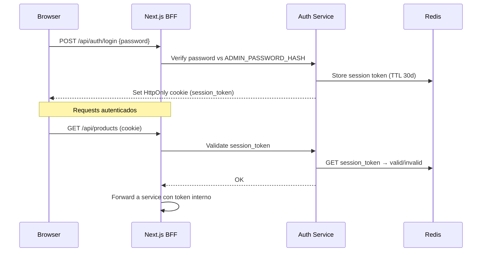
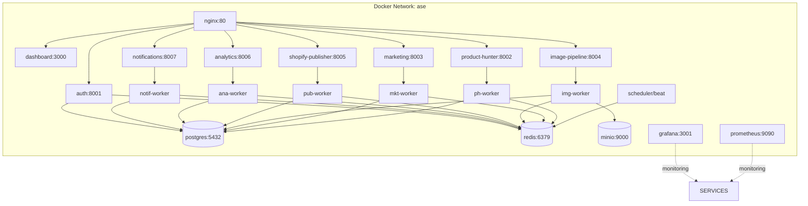

# Autonomous Shopify Engine (ASE) — Architecture

> **Uso personal:** Un único usuario administrador, 1-3 tiendas Shopify propias.
> Sin overhead de SaaS: sin multi-tenancy complejo, sin RBAC, sin API Gateway.

---

## 1. System Overview

ASE es una plataforma multiagente para uso personal que descubre productos ganadores,
genera contenido de marketing, publica en Shopify y monitoriza el rendimiento —
todo desde un dashboard local.

**Principios de diseño:**
- Cada agente es un servicio independiente con su propio worker Celery
- Toda operación asíncrona va por Celery/Redis
- El dashboard Next.js actúa como BFF (proxy directo a los servicios)
- Un solo usuario; sin gestión de cuentas ni permisos complejos
- Corre completo en una sola máquina con Docker Compose

---

## 2. System Topology

---

## 3. Product Lifecycle

---

## 4. Agent Orchestration

---

## 5. Auth Flow (Personal Use — Simplified)

---

## 6. Infrastructure (Docker Compose — Personal)

---

## 7. Service Summary

| Service | Port | Función |
|---|---|---|
| Nginx | 80 | Reverse proxy simple |
| Dashboard (Next.js) | 3000 | UI + BFF |
| Auth Service | 8001 | Login único, session tokens |
| Product Hunter | 8002 | Scraping + scoring |
| Marketing | 8003 | Copy + SEO + ads con DeepSeek |
| Image Pipeline | 8004 | Generación de imágenes + MinIO |
| Shopify Publisher | 8005 | Shopify Admin API |
| Analytics | 8006 | Métricas + decisiones ROAS |
| Notifications | 8007 | Email/Discord/Telegram/Slack |
| Scheduler | — | Celery Beat (tareas programadas) |
| PostgreSQL | 5432 | Base de datos principal |
| Redis | 6379 | Broker Celery + cache sesiones |
| MinIO | 9000 | Storage S3-compatible |
| Prometheus | 9090 | Métricas |
| Grafana | 3001 | Dashboards de métricas |

---

## 8. Security (Personal Use)

- **Auth:** Una sola contraseña de admin hasheada con bcrypt en `.env`
- **Session:** Token opaco almacenado en Redis, HttpOnly cookie
- **Red:** Todos los servicios en red Docker privada; solo Nginx expuesto en :80
- **Secrets:** Variables de entorno en `.env.local` (git-ignored)
- **Shopify tokens:** Cifrados con Fernet antes de almacenar en DB
- **Transport:** Nginx con certificado auto-firmado local (Let's Encrypt opcional con dominio)

---

## 9. Observability

Cada servicio expone:
- `GET /health` — liveness
- `GET /metrics` — Prometheus scrape

Grafana dashboards:
- ASE Overview (ROAS, revenue, agent status)
- Celery Workers (queue depth, task rate)
- Product Hunter Pipeline (candidates/hour, score distribution)
